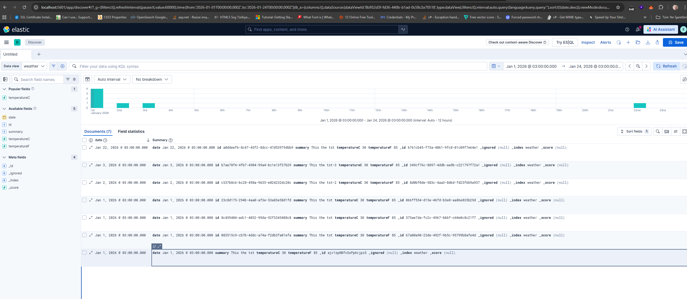

# ElasticSearchTestAPI

A sample **ASP.NET Core (.NET 10) Web API** that demonstrates how to integrate **Elasticsearch 9.3.x** using the official `Elastic.Clients.Elasticsearch` NuGet package. The project exposes a simple `WeatherForecast` resource and shows how to index single documents and perform bulk indexing into Elasticsearch over a secured (HTTPS) connection.

---

## Table of Contents

- [Prerequisites](#prerequisites)
- [Elasticsearch Setup (Docker)](#elasticsearch-setup-docker)
- [Kibana Setup (Docker)](#kibana-setup-docker)
- [Project Overview](#project-overview)
- [Project Structure](#project-structure)
- [Configuration (`appsettings.json`)](#configuration-appsettingsjson)
- [How It Works](#how-it-works)
- [Running the API](#running-the-api)
- [API Endpoints](#api-endpoints)
- [Verifying Data in Kibana](#verifying-data-in-kibana)
- [Troubleshooting](#troubleshooting)
- [License](#license)

---

## Prerequisites

- [Docker Desktop](https://www.docker.com/products/docker-desktop/)
- [.NET 10 SDK](https://dotnet.microsoft.com/download)
- A REST client (e.g. `curl`, Postman, or the included `ElasticSearchTestAPI.http` file)

---

## Elasticsearch Setup (Docker)

The following steps spin up a single-node Elasticsearch 9.3.3 cluster inside Docker, on a dedicated network so that Kibana (and any other container) can reach it by name.

### 1) Create a dedicated Docker network

```bash
docker network create elastic
```

> **Why a network?** A Docker network is mainly used to manage, isolate, and optimize how containers communicate with each other and with the outside world. By placing Elasticsearch and Kibana on the same `elastic` network, they can resolve each other by container name (e.g. `es01`).

### 2) Pull the Elasticsearch image

```bash
docker pull docker.elastic.co/elasticsearch/elasticsearch:9.3.3
```

### 3) Run the Elasticsearch container

```bash
docker run --name es01 --net elastic -p 9200:9200 -it -m 1GB docker.elastic.co/elasticsearch/elasticsearch:9.3.3
```

This exposes Elasticsearch on `https://localhost:9200` and limits the container to 1 GB of memory.

### 4) Capture the generated credentials

When the container starts for the first time, Elasticsearch prints important information to the console:

- The auto-generated **password** for the `elastic` superuser
- The **HTTP CA certificate fingerprint** (SHA-256)
- A **Kibana enrollment token** (valid for 30 minutes)

**Copy these values immediately** — you will use them in `appsettings.json` and during Kibana setup.

### 5) Regenerating credentials (if needed)

If you lose the password or the Kibana token expires, you can regenerate them:

**a) Reset the `elastic` user password**

```bash
docker exec -it es01 /usr/share/elasticsearch/bin/elasticsearch-reset-password -u elastic
```

**b) Generate a new Kibana enrollment token**

```bash
docker exec -it es01 /usr/share/elasticsearch/bin/elasticsearch-create-enrollment-token -s kibana
```

### 6) (Optional) Verify the cluster from the host

**a) Copy the HTTP CA certificate from the container to your host**

```bash
docker cp es01:/usr/share/elasticsearch/config/certs/http_ca.crt c:/users
```

**b) Hit the Elasticsearch root endpoint with `curl`**

```bash
curl.exe --cacert "c:\users\majin\http_ca.crt" --insecure -u elastic:YCh9Ys_DP0JT=4ciTs1= https://localhost:9200
```

Replace the password with your own. A successful response returns the cluster information as JSON.

---

## Kibana Setup (Docker)

Kibana provides a web UI for exploring and visualizing the data stored in Elasticsearch.

### 1) Pull the Kibana image

```bash
docker pull docker.elastic.co/kibana/kibana:9.3.3
```

### 2) Run the Kibana container

```bash
docker run --name kib01 --net elastic -p 5601:5601 docker.elastic.co/kibana/kibana:9.3.3
```

Kibana will be reachable at `http://localhost:5601`.

### 3) Generate an enrollment token for Kibana

```bash
docker exec -it es01 /usr/share/elasticsearch/bin/elasticsearch-create-enrollment-token -s kibana
```

### 4) Complete the Kibana enrollment in the browser

1. Open `http://localhost:5601` in your browser.
2. Paste the **enrollment token** from the previous step.
3. Kibana will then ask for a **verification code**. This 6-digit code is printed in the Kibana container logs (visible in Docker Desktop), for example:

   ```
   Your verification code is:  305 832
   ```

4. Enter the code to finish the setup. After that, log in with the `elastic` user and the password you captured (or reset) earlier.

---

## Project Overview

`ElasticSearchTestAPI` is a minimal Web API built on **ASP.NET Core (.NET 10)** that:

- Registers a singleton `ElasticsearchClient` configured from `appsettings.json`.
- Exposes a `WeatherForecast` controller with three endpoints: read sample data, index a single document, and bulk-index multiple documents into the `weather` index.
- Communicates with Elasticsearch over HTTPS using basic authentication, a client CA certificate, and a certificate fingerprint for secure validation.

---

## Project Structure

```
ElasticSearchTestAPI/
├── ElasticSearchTestAPI.slnx              # Solution file
├── README.md
├── LICENSE.txt
└── ElasticSearchTestAPI/
    ├── ElasticSearchTestAPI.csproj        # .NET 10 Web SDK project
    ├── Program.cs                         # App bootstrap & ES client registration
    ├── ElasticSearch.cs                   # Strongly-typed config class
    ├── WeatherForecast.cs                 # Sample domain model
    ├── appsettings.json                   # ES connection settings
    ├── appsettings.Development.json
    ├── ElasticSearchTestAPI.http          # Sample HTTP requests
    └── Controllers/
        └── WeatherForecastController.cs   # API endpoints
```

---

## Configuration (`appsettings.json`)

The Elasticsearch connection is configured under the `ElasticSearch` section:

```json
{
  "ElasticSearch": {
    "Uri": "https://localhost:9200",
    "DefaultIndex": "weather",
    "Username": "elastic",
    "Password": "YCh9Ys_DP0JT=4ciTs1=",
    "ClientSertificatePath": "c:\\users\\majin\\http_ca.crt",
    "CertificateFingerprint": "fa0054d54b56f6aae2bd4e78ca86bb8e43df971e0c914847f1cee7baa705c3a2"
  }
}
```

| Key | Description |
| --- | --- |
| `Uri` | Base URL of the Elasticsearch node. |
| `DefaultIndex` | Default index used by the client. |
| `Username` / `Password` | Basic-auth credentials for the `elastic` user. |
| `ClientSertificatePath` | Local path to the `http_ca.crt` copied from the container. |
| `CertificateFingerprint` | SHA-256 fingerprint of the HTTP CA certificate. |

> **Important:** The values shown above are placeholders from a local environment. **Do not commit your real credentials.** Replace them with your own — ideally via [User Secrets](https://learn.microsoft.com/aspnet/core/security/app-secrets) or environment variables.

### How to obtain the certificate fingerprint

```bash
docker exec -it es01 openssl x509 -fingerprint -sha256 -in config/certs/http_ca.crt
```

Strip the colons from the output and paste it into `CertificateFingerprint`.

---

## How It Works

`Program.cs` reads the `ElasticSearch` section, builds an `ElasticsearchClientSettings` object, and registers the resulting `ElasticsearchClient` as a singleton in the DI container:

```csharp
var elasticSearchConfig = builder.Configuration
    .GetSection("ElasticSearch")
    .Get<ElasticSearch>();

var settings = new ElasticsearchClientSettings(new Uri(elasticSearchConfig.Uri))
    .ClientCertificate(elasticSearchConfig.ClientSertificatePath)
    .CertificateFingerprint(elasticSearchConfig.CertificateFingerprint)
    .DefaultIndex(elasticSearchConfig.DefaultIndex)
    .Authentication(new BasicAuthentication(
        elasticSearchConfig.Username,
        elasticSearchConfig.Password));

var client = new ElasticsearchClient(settings);
builder.Services.AddSingleton(client);
```

The `WeatherForecastController` then injects this client and uses `IndexAsync` / `BulkAsync` to write documents into the `weather` index.

---

## Running the API

From the repository root:

```bash
cd ElasticSearchTestAPI
dotnet restore
dotnet run
```

By default, the API is hosted at `http://localhost:5210` (see `ElasticSearchTestAPI.http`). OpenAPI metadata is exposed in development mode at `/openapi/v1.json`.

---

## API Endpoints

### `GET /WeatherForecast`

Returns 5 randomly generated weather forecasts. **Does not write to Elasticsearch.**

```http
GET http://localhost:5210/WeatherForecast
Accept: application/json
```

### `POST /WeatherForecast`

Indexes a **single** `WeatherForecast` document into the `weather` index.

```http
POST http://localhost:5210/WeatherForecast
Content-Type: application/json

{
  "date": "2026-04-27T00:00:00",
  "temperatureC": 22,
  "summary": "Warm"
}
```

Returns `201 Created` on success or `400 Bad Request` if Elasticsearch rejects the request.

### `POST /WeatherForecast/bulk`

Indexes **multiple** `WeatherForecast` documents in a single bulk request.

```http
POST http://localhost:5210/WeatherForecast/bulk
Content-Type: application/json

[
  { "date": "2026-04-27T00:00:00", "temperatureC": 22, "summary": "Warm" },
  { "date": "2026-04-28T00:00:00", "temperatureC": 18, "summary": "Mild" },
  { "date": "2026-04-29T00:00:00", "temperatureC": 30, "summary": "Hot"  }
]
```

You can verify the inserted documents in Kibana under **Stack Management → Index Management** or by querying directly:

```bash
curl.exe --cacert "c:\users\majin\http_ca.crt" -u elastic:<password> https://localhost:9200/weather/_search
```

---

## Verifying Data in Kibana

After indexing documents through the API endpoints above, you can inspect them visually in Kibana (**Discover** / **Dev Tools**). The screenshot below shows the `weather` index populated with documents that were sent to the API:



> Tip: If the index is not visible in Kibana, create a **Data View** for the `weather*` index pattern under **Stack Management → Data Views**.

---

## Troubleshooting

- **`The remote certificate is invalid` / TLS errors**
  Make sure `ClientSertificatePath` points to the `http_ca.crt` you copied out of the container, and that `CertificateFingerprint` matches the current certificate.
- **`401 Unauthorized`**
  The `elastic` password has changed. Reset it with the command in step 5a and update `appsettings.json`.
- **Kibana enrollment token expired**
  Generate a fresh one with the command in step 5b (tokens are valid for 30 minutes).
- **Container exits immediately due to memory**
  Increase the `-m` flag in step 3 (e.g. `-m 2GB`) or raise Docker Desktop's memory limit.

---

## License

This project is distributed under the terms of the [LICENSE](LICENSE.txt) file included in this repository.
